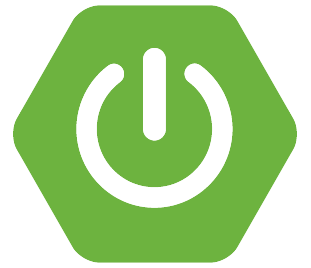
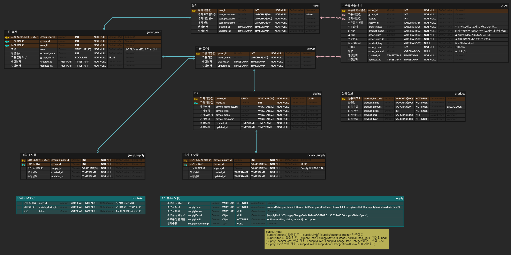

 
    
    <h2>소모아 백엔드</h2>

 

# 기술 스택

|                       Java 17                        |                     Spring Boot 3.2.3                      |                     Spring Webflux 3.2.3                      |                     Spring Security 6.2.2                      |                         Firebase                         |
| :--------------------------------------------------: | :--------------------------------------------------------: | :-----------------------------------------------------------: | :------------------------------------------------------------: | :------------------------------------------------------: |
|  |  |  |  |  |

|                     MariaDB 11.4.1                      |                         MongoDB                         |
| :-----------------------------------------------------: | :-----------------------------------------------------: |
|  |  |

# ERD

# API

## 인증

|                                     Method                                      | URI               | 설명            |                                     우선순위                                      |
| :-----------------------------------------------------------------------------: | ----------------- | --------------- | :-------------------------------------------------------------------------------: |
|  | /api/user/signup  | 회원가입        |     |
|  | /api/user/login   | 로그인          |  |
|  | /api/user/logout  | 로그아웃        |     |
|  | /api/user/refresh | 엑세스토큰 갱신 |  |

## 그룹

|                                      Method                                       | URI                                               | 설명                       |                                     우선순위                                      |
| :-------------------------------------------------------------------------------: | ------------------------------------------------- | -------------------------- | :-------------------------------------------------------------------------------: |
|    | /api/groups                                       | 그룹 생성                  |    |
|     | /api/groups                                       | 그룹 목록 조회             |    |
|     | /api/groups/{group_id}                            | 그룹 상세 조회             |    |
|   | /api/groups/{group_id}                            | 그룹 이름 수정             |     |
|  | /api/groups/{group_id}                            | 그룹 삭제                  |     |
|   | /api/groups/{group_id}/users/{user_id}/permission | 그룹 멤버의 권한 수정      |  |
|  | /api/groups/{group_id}/leave                      | 그룹 나가기                |  |
|    | /api/groups/{group_id}/users                      | 그룹 멤버 추가             |    |
|     | /api/groups/{group_id}/users                      | 그룹에 속한 멤버 조회      |    |
|  | /api/groups/{group_id}/users                      | 그룹 멤버 삭제             |     |
|     | /api/groups/{group_id}/devices                    | 그룹에 속한 기기 목록 조회 |    |
|     | /api/groups/{group_id}/orders                     | 그룹에 속한 주문 목록 조회 |    |
|   | /api/groups/{group_id}/alarm                      | 그룹 알람 여부 변경        |     |
|   | /api/groups/group-order                           | 그룹 표시 순서 변경        |     |

## 기기

|                                      Method                                       | URI                      | 설명                |                                    우선순위                                     |
| :-------------------------------------------------------------------------------: | ------------------------ | ------------------- | :-----------------------------------------------------------------------------: |
|    | /api/devices             | 기기 등록           |  |
|     | /api/devices/{device_id} | 기기 상세 조회      |  |
|   | /api/devices/{device_id} | 기기 이름 수정      |   |
|  | /api/devices/{device_id} | 기기 삭제           |   |
|    | /api/devices/{device_id} | 기기 상태 정보 받음 |  |

## 소모품

|                                      Method                                      | URI                             | 설명                                     |                                     우선순위                                      |
| :------------------------------------------------------------------------------: | ------------------------------- | ---------------------------------------- | :-------------------------------------------------------------------------------: |
|    | /api/supplies/barcode           | 소모품 바코드 조회                       |     |
|  | /api/supplies/{supply_id}       | 소모품 보유량 수정                       |    |
|    | /api/supplies                   | 조건에 맞는 소모품 목록                  |  |
|    | /api/supplies/all               | 유저가 속한 그룹의 전체 소모품 목록      |  |
|    | /api/supplies/groupsupply       | 유저가 속한 특정 그룹의 전체 소모품 조회 |     |
|  | /api/supplies/limit/{supply_id} | 소모품 알림기준 수정                     |  |

## 주문

|                                      Method                                      | URI                                  | 설명                                                    |                                     우선순위                                      |
| :------------------------------------------------------------------------------: | ------------------------------------ | ------------------------------------------------------- | :-------------------------------------------------------------------------------: |
|   | /api/orders                          | 주문 등록                                               |    |
|  | /api/orders/{order_store}/{order_id} | 주문 수정 - 배송 현황                                   |    |
|    | /api/orders                          | 주문 내역 조회                                          |  |
|    | /api/orders/in-progress              | 배송 중인 주문 내역 조회                                |  |
|    | /api/user/orders                     | 주문 목록 중 "배송 중", "주문 목록" 상태 주문 목록 조회 |    |
